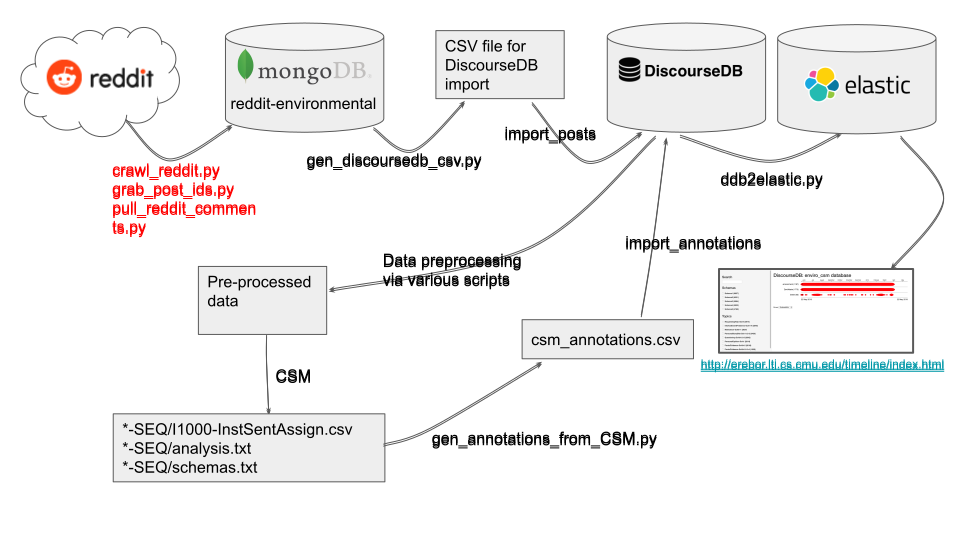

## This document describes three workflows:
  1. How data is scraped from reddit directly into Discoursedb without analysis
  2. How data is scraped from reddit, analyzed, piped through a *different* discoursedb database, into a visualization engine
  3. A *planned* pipeline that unifies these two, routing data through a single DiscourseDB database before analysis

## Current scraping into text database
  * crawl_reddit.py is called periodically by a cron job, checking the Reddit API for new posts associated with a list of subreddits of interest.  It puts the JSON records it retrieves into a mongo database (in collection `posts`) and updates a latest retrieval date in collection `scrapedates` for each subreddit.
  * gen_discoursedb_csv.py is also called periodically; it extracts new mongo records and prepares [a CSV file needed for import into DiscourseDB](https://github.com/DiscourseDB/discoursedb-core/tree/master/discoursedb-io-csv).
  * Finally, a DiscourseDB script, [import_posts](https://github.com/DiscourseDB/discoursedb-core/blob/master/discoursedb-io-csv/import_posts_split), is called which imports that CSV file into discourseDB.
  * That data is available as unannotated text in [DiscourseDB](http://discoursedb.github.io) (currently in database EnviroReddit).

## Current scraping and analysis for visualization
  * After crawl_reddit.py loads data into Mongo, *Fill in details please!*, resulting in preprocessed data stored *somewhere*
  * Preprocessing is done, separating out sentences and removing punctuation
  * Analysis software called [CSM](https://github.com/yohanjo/Dialogue-Acts) is run.
  * The analyst manually creates topics.txt and schemas.txt files that identify the topics schemas encompass, and name the topics.
  * gen_annotations_from_CSM.py reconstructs reddit posts from CSM's output and produces [a CSV file needed for import into DiscourseDB](https://github.com/DiscourseDB/discoursedb-core/tree/master/discoursedb-io-csv).  Unfortunately this is still lacking punctuation and case, since it is reconstructed from preprocessed data.  This is different from the CSV file produced in the process described above, because it has each sentence labelled with the topic and schemas it belongs to
  * A DiscourseDB script, [import_posts](https://github.com/DiscourseDB/discoursedb-core/blob/master/discoursedb-io-csv/import_posts_split), is called which imports that CSV file into discourseDB. 
  * Another discourseDB script, *TODO: check into github and share link here*, exports this discourseDB database into ElasticSearch, from which [this web service visualizes the annotated data.](http://erebor.lti.cs.cmu.edu/timeline/index.html)  This export requires using the DiscourseDB interface to create and name a selection within this database, that the script uses to identify the data it is going to export.

## Future pipeline
  * The proposed future pipeline will have the preprocessing/CSM analysis get data from DiscourseDB, rather than from the Mongo database, so that others can use the same tool on their own DiscourseDB data.
  * This will require that the output of CSM be linked back to record IDs in the DiscourseDB extract, so that instead of importing full records after CSM, only annotations on existing DiscourseDB records need to be uploaded back to DiscourseDB.
  * The export to Elasticsearch will be similar, but it may be better to have the script just grab an entire DiscourseDB database rather than a manual selection of records, so it can be automated and updated on a schedule. 

Note: the original diagrams can be edited here: [Google presentation document](https://docs.google.com/presentation/d/1PVBqB9JszFavSs7fRTzZDT2bMSakVAS9y4JjEq8TZrM/edit#slide=id.g5195033c36_0_91)
